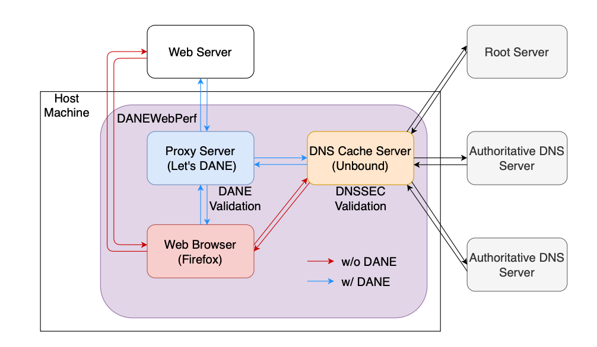
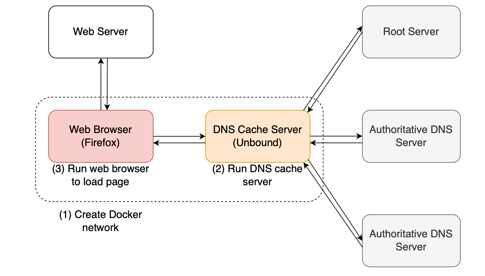
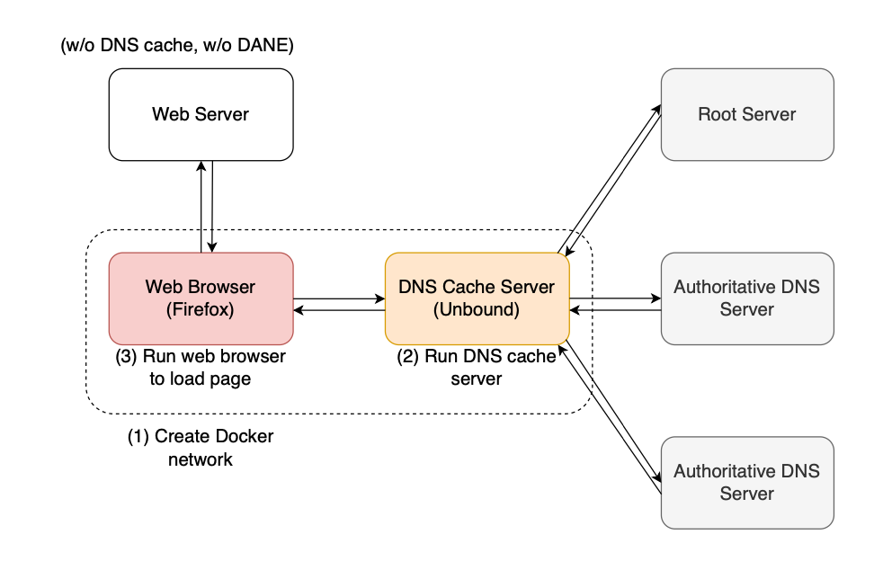
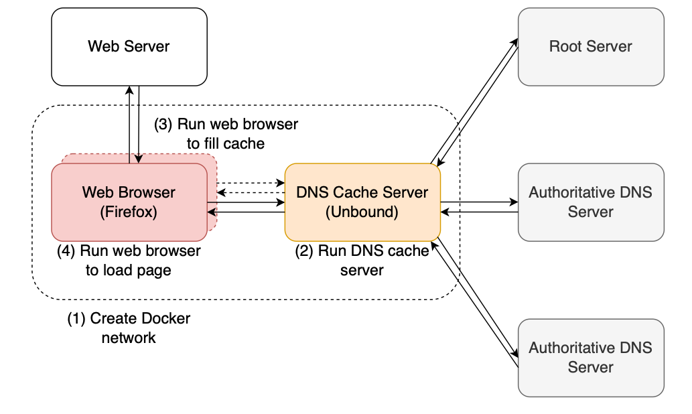
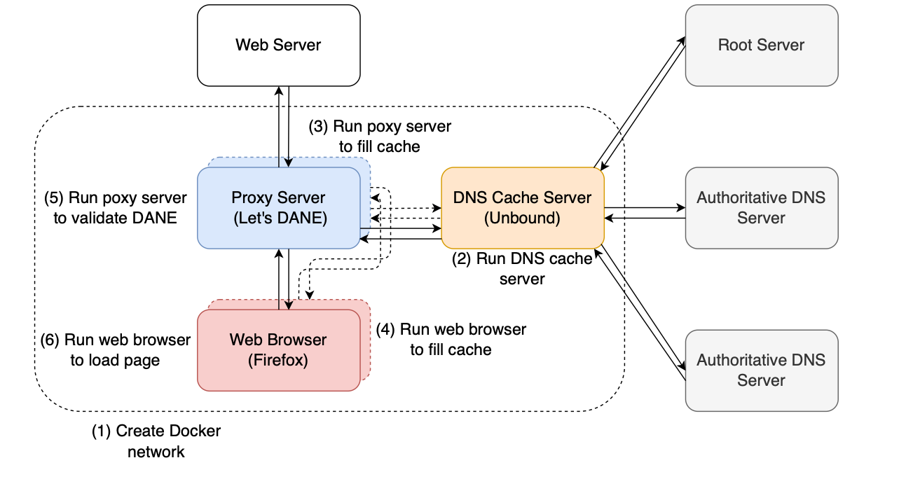

# DANEWebPerf

DANEWebPerf is a tool developed to measure the impact of DNS-based Authentication of Named Entities (DANE) on webpage load times.

If you use this code in your research or project, please cite the following paper:

K. Yagi, K. Isobe, D. Kondo, and H. Tode, ''[Impact of DANE on Webpage Load Time](https://opendl.ifip-tc6.org/db/conf/cnsm/cnsm2024/1571050403.pdf),'' in [*Proc. the 20th International Conference on Network and Service Management (CNSM)*, 2024.](http://www.cnsm-conf.org/2024/) (Accepted)


## Overview



DANEWebPerf consists of three main components and あll components run in independent Docker containers within the same Docker network.

### Firefox

[The Docker image employed by Hounsel et al.](https://github.com/yagikota/dns-measurement?tab=readme-ov-file#images) was used. Within the container, Firefox 67.0.1 was run in headless mode and controlled via Selenium 3.141.0. It allows setting a timeout value for the webpage load time, which was set to 30 seconds in this study. When DANE is not used, the IP address of the DNS cache server container is passed to the Firefox container at startup. When using DANE, the IP address of the Let’s DANE container is passed to the Firefox container at startup, which reads the self-signed certificate generated by Let’s DANE as the root certificate. The reason is described below.

### Unbound

[The existing Docker image](https://hub.docker.com/layers/secns/unbound/1.19.1/images/sha256-a5b72cbfd7d4f8597eeb2c566a02324143dfe2f341ed188631bc0c3995003c8b?context=explore) was used as the DNS cache server. The container employed Unbound 1.19.1 with DNSSEC validation. The caching function could be controlled by the environment variables provided. In this study, to enable the caching function, the minimum time-to-live (TTL) for the positive cache, maximum TTL for the positive cache, and maximum TTL for the negative cache were set to 86,400, 86,400, and 3,600 seconds, respectively. These values were large enough to generate cache hits because a maximum of 30 seconds was required to obtain the webpage load time for a single website due to the timeout setting. To disable the caching function, the three values were set to 0 seconds to ensure that no cache hits occurred.

### Let’s DANE

[Let’s DANE](https://github.com/buffrr/letsdane) is a lightweight proxy that enables the use of DANE in applications such as web browsers. At the time of writing, only the server certificate verification method of DANE-EE(3) was available. Let’s DANE queries the DNS for TLSA records and verifies server certificates using DANE on behalf of the web browser. If the verification is successful, Let’s DANE generates a new server certificate. Firefox imports the self-signed certificate issued by Let’s DANE as a root certificate; thus, Firefox can use the new server certificate received from Let’s DANE to access the website. Additionally, Firefox uses the normal root certificate to access websites whose domains do not support DANE.

### Measurement Scenarios

- (w/o DNS cache, w/o DANE)
  - In this scenario, the DNS cache is disabled and DANE is
not used. It assumes that the user accesses infrequently
accessed websites via conventional web browsing. The
Firefox container sends a DNS query to the Unbound
container to access the desired website.
  

- (w/o DNS cache, w/ DANE)
  - In this scenario, DANE is used but the DNS cache
disabled. It assumes that the user accesses infrequently accessed websites when browsing with DANE. The Fire-
fox container uses the Let’s DANE container as a proxy
and sends a DNS query to the Unbound container to
access the desired website.
  
- (w/ DNS cache, w/o DANE)
  - In this scenario, the DNS cache is enabled and DANE
is not used. It assumes a case wherein a frequently
accessed website is accessed using conventional web
browsing. The Firefox container makes a DNS query
to the Unbound container to store the DNS cache and
access the desired website. Subsequently, another Firefox
container is launched in the same Docker network and
sends a DNS query to the Unbound container to likewise
access the same website. Thus, the Firefox container can
use the DNS cache, and the webpage load time with the
container is obtained.
  

- (w/ DNS cache, w/ DANE)
  - In this scenario, both DANE and the DNS cache are
enabled. This is assumed to be a case wherein frequently
accessed websites are accessed by web browsing with
DANE. The Firefox container uses the Let’s DANE
container as a proxy to send DNS queries to the Unbound
container to access the desired website and store the DNS
cache. Next, another Firefox container and a Let’s DANE
container are launched in the same Docker network, and
a DNS query is sent to the Unbound container to likewise
access the same website. Thus, the Firefox container can
use the DNS cache, and the webpage load time with the
container is obtained
  

## Usage

### Prerequisites

DaneWebPerf is supposed to be run on EC2 instance and the measurement results are stored in S3 bucket. Therefore, you need to set up EC2 instance and S3 bucket before running DaneWebPerf.

### Install DALEWebPerf on EC2 instance

```bash
./install.sh
```

### Build docker images on EC2 instance

```bash
./prepare.sh
```

### Start measurement

```bash
nohup ./start.sh [measurementID] [number of domain] [concurrency] &
```

- `measurementID`: The ID of the measurement. The measurement results are stored in S3 bucket with this ID.
- `number of domain`: The number of domains to be measured.
  - In this measurement, We can use [this dataset](./dataset/hall-of-flame-websites-tlsa-usage3.csv), so the number of domain should be less than 4022.
- `concurrency`: The number of concurrent measurements.
  - This value depends on your EC2 instance's performance, but it's recommended to set this value to 10~20.

The measurement wiil take about 7~8 hours if you set `number of domain` to 4022 and `concurrency` to 20.

### Results

The measurement results are stored in S3 bucket with the following structure.

``` bash
pageloadtime-results // The bucket name
└── [measurementID] // The measurement ID you specified
    ├── example.com // The domain name
    │   ├── firefox-examples.com-with-cache-with-dane.pcap # The pcap file of the measurement with cache and DANE in Firefox
    │   ├── firefox-examples.com-with-cache-without-dane.pcap # The pcap file of the measurement with cache and without DANE in Firefox
    │   ├── firefox-examples.com-without-cache-with-dane.pcap # The pcap file of the measurement without cache and with DANE in Firefox
    │   ├── firefox-examples.com-without-cache-without-dane.pcap # The pcap file of the measurement without cache and DANE in Firefox
    │   ├── letsdane-examples.com-with-cache-with-dane.csv # This csv file contains the DANE validation result of each HTTPS request in Let's DANE
    │   ├── letsdane-examples.com-with-cache-with-dane.pcap # The pcap file of the measurement with cache and DANE in Let's DANE
    │   ├── letsdane-examples.com-without-cache-with-dane.pcap # The pcap file of the measurement without cache and with DANE in Let's DANE
    │   ├── letsdane-examples.com-without-cache-with-dane.csv # This csv file contains the DANE validation result of each HTTPS request in Let's DANE
    │   ├── unbound-examples.com-with-cache-with-dane.pcap # The pcap file of the measurement with cache and DANE in Unbound
    │   ├── unbound-examples.com-with-cache-without-dane.pcap # The pcap file of the measurement with cache and without DANE in Unbound
    │   ├── unbound-examples.com-without-cache-with-dane.pcap # The pcap file of the measurement without cache and with DANE in Unbound
    │   ├── unbound-examples.com-without-cache-without-dane.pcap # The pcap file of the measurement without cache and DANE in Unbound
    │   ├── examples.com-with-cache-with-dane.har # The har file of the measurement with cache and DANE
    │   ├── examples.com-with-cache-with-dane.csv # The csv file of the measurement with cache and DANE. This file contains the specific data of har file.
    │   ├── examples.com-with-cache-without-dane.har # The har file of the measurement with cache and without DANE
    │   ├── examples.com-with-cache-without-dane.csv # This file contains the specific data of har file.
    │   ├── examples.com-without-cache-with-dane.har # The har file of the measurement without cache and with DANE
    │   ├── examples.com-without-cache-with-dane.csv # This file contains the specific data of har file.
    │   ├── examples.com-without-cache-without-dane.har # The har file of the measurement without cache and DANE
    │   ├── examples.com-without-cache-without-dane.csv # This file contains the specific data of har file.
    ├── example2.com
    │   ├── ...
    │
    ├── without-cache-without-dane.log # The log file of the measurement without cache and DANE
    ├── without-cache-with-dane.log # The log file of the measurement without cache and with DANE
    ├── with-cache-without-dane.log # The log file of the measurement with cache and without DANE
    └── with-cache-with-dane.log # The log file of the measurement with cache and with DANE
```

## Contact

Contributions are welcome!


## Credits

Thanks to the following awesome tools.

- https://github.com/noise-lab/dns-measurement?tab=readme-ov-file#images
- https://hub.docker.com/layers/secns/unbound/1.19.1/images/sha256-a5b72cbfd7d4f8597eeb2c566a02324143dfe2f341ed188631bc0c3995003c8b?context=explore
- https://github.com/buffrr/letsdane
- https://github.com/zmap/zdns


